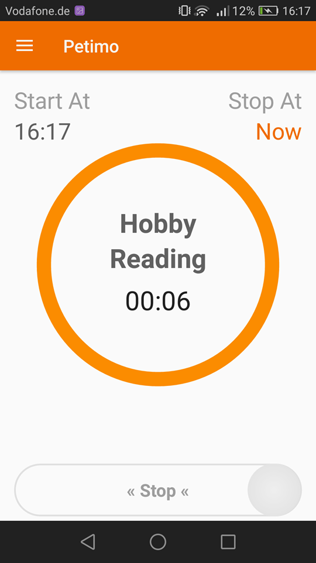
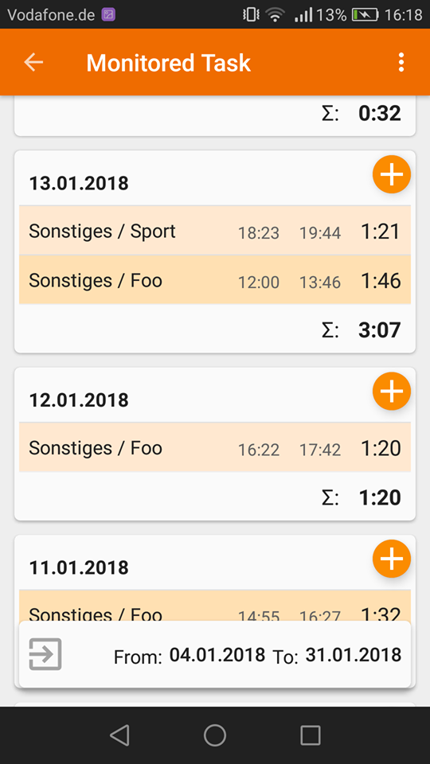
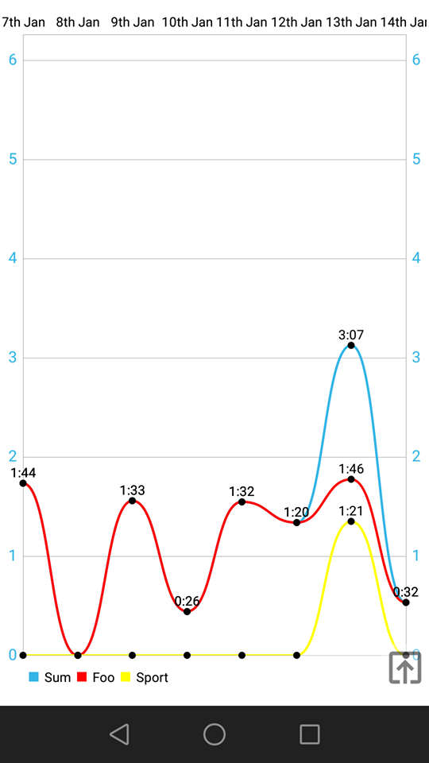
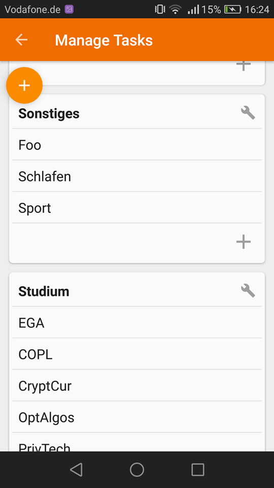

## __Pe__rsonal __Ti__me __Mo__nitor  

### What is it
A little Android app I created to replace my CLI Python app which did basically the same task in a much more uncomfortable way. I personally have used this app during my whole study and up to now. It does give me an good overview of how efficient I am for different tasks. 

### Why monitoring  
I used to make and follow (time) plan(s) but that did not work. Then I found out that just monitoring is way better than planning. Back then I wrote a simple CLI Python app to do the work. It became very soon overwhelmed and I decided to make an Android app to monitor my time better. The monitoring mechanism is yet manual and static for now.

### How does it work  
This App is pretty simple just like its philosophy. You create tasks and monitor how much time you invest in those tasks. That's it. At the end of the day there's a statistics feature that displays the monitored time in a colored line graph. 

<table style="width:80%">
  <tr>
    <th width='50%'> <b>Main screen</b></th>  
    <th width='50%'> <b>Managing monitored time slots</b></th>
  </tr>
  <tr>
    <th width='50%'>  </th>  
    <th width='50%'>  </th>
  </tr>
    <th colspan="2"> </th>
  <tr>
  </tr>
  <tr>
    <th width='50%'> <b>Line graph of monitored tasks</b></th>  
    <th width='50%'> <b>Managing tasks to monitor</b></th>
  </tr>
  <tr>
    <th width='50%'>  </th>  
    <th width='50%'>  </th>
  </tr>
</table>

